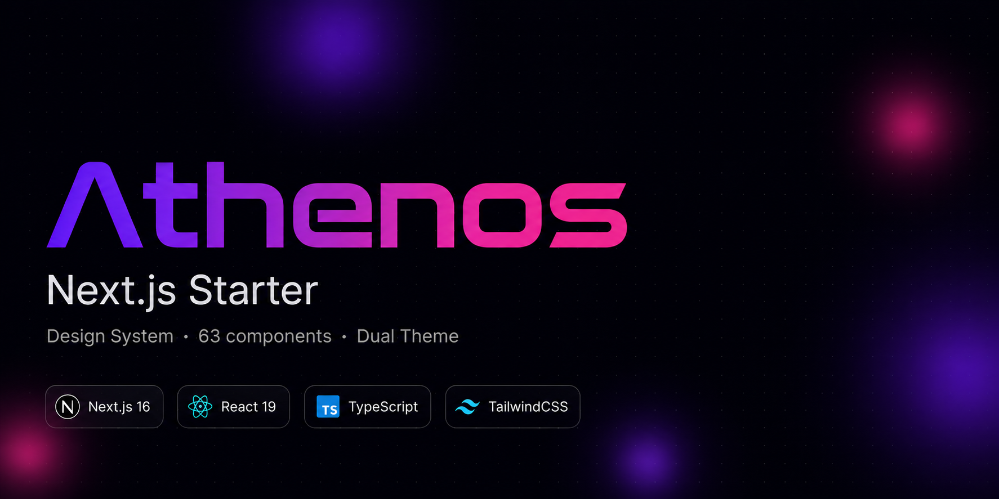

## Demo

Após rodar localmente, acesse **`/components`** para ver todos os 63 componentes interativos organizados por categoria, com tema claro/escuro e navegação lateral com scroll animado.

---

## Features

| | |
|---|---|
| 🧩 63 componentes prontos para produção | 🎨 Dual theme (light/dark) via CSS Variables |
| 🪝 9 hooks customizados | 🛠️ 3 módulos de utilitários (format, validators, dates) |
| ⚡ Next.js 16 + Turbopack + React 19 | 🔷 TypeScript estrito |
| 🎯 TailwindCSS com tokens CSS integrados | 📐 z-index, sombras, raios e transições padronizados |
| 🎞️ Animações CSS nativas (sem libs externas) | ♿ Acessibilidade (foco visível, aria, roles) |

---

## Stack

| Tecnologia | Versão | Papel |
|---|---|---|
| [Next.js](https://nextjs.org) | 16.2 | Framework (App Router + Turbopack) |
| [React](https://react.dev) | 19 | UI runtime |
| [TypeScript](https://typescriptlang.org) | 5 | Tipagem estática |
| [TailwindCSS](https://tailwindcss.com) | 3.4 | Utilitários CSS |
| [lucide-react](https://lucide.dev) | 0.441 | Ícones |
| [clsx](https://github.com/lukeed/clsx) + [tailwind-merge](https://github.com/dcastil/tailwind-merge) | — | Composição de classes |

---

## Getting Started

```bash
# Clonar o repositório
git clone https://github.com/gmatheusb/athenos-starter-nextjs.git meu-projeto
cd meu-projeto

# Instalar dependências
npm install

# Iniciar em desenvolvimento
npm run dev
```

Abra [http://localhost:3000/components](http://localhost:3000/components) para ver o showcase de componentes.

---

## Estrutura de Pastas

```
src/
├── app/                    # Next.js App Router
│   ├── (examples)/         # Páginas de exemplo (login, components)
│   ├── globals.css         # Tokens CSS, dual theme, animações
│   └── layout.tsx          # Root layout com ThemeProvider + ToastProvider
├── components/
│   ├── ui/                 # 63 componentes do design system
│   ├── layout/             # Sidebar, Navbar
│   └── auth/               # AuthOrbs (fundo animado)
├── hooks/                  # 9 hooks customizados
└── lib/                    # Utilitários: format, validators, dates, cn

design/
├── design.md               # Fonte única de verdade do design system
└── docs/                   # 8 arquivos de documentação detalhada
```

---

## Componentes

<details>
<summary><strong>Básico</strong> — 15 componentes</summary>

`Button` `Alert` `Avatar` `AvatarGroup` `Badge` `Tag` `Spinner` `Progress` `Skeleton` `KbdShortcut` `StatCard` `CountUp` `EmptyState` `Card` `Divider`

</details>

<details>
<summary><strong>Formulários</strong> — 20 componentes</summary>

`Input` `Select` `Textarea` `Checkbox` `Switch` `RadioGroup` `Slider` `NumberInput` `Rating` `SearchInput` `MaskInput` `TimeInput` `ColorPicker` `OTPInput` `TagInput` `Combobox` `MultiSelect` `DatePicker` `DateRangePicker` `FileUpload`

</details>

<details>
<summary><strong>Feedback</strong> — 7 componentes</summary>

`Banner` `Callout` `Toast` `NotificationCenter` `Modal` `Drawer` `ConfirmDialog`

</details>

<details>
<summary><strong>Navegação</strong> — 12 componentes</summary>

`Tabs` `Pagination` `Breadcrumb` `Stepper` `Accordion` `Collapsible` `Tooltip` `Popover` `HoverCard` `DropdownMenu` `NavigationMenu` `CommandPalette`

</details>

<details>
<summary><strong>Dados</strong> — 8 componentes</summary>

`PageHeader` `DataTable` `Timeline` `CodeBlock` `Carousel` `VirtualList` `ScrollArea` `CopyButton`

</details>

Todos exportados de `@/components/ui`:

```tsx
import { Button, Input, Modal, DataTable } from '@/components/ui'
```

---

## Hooks

| Hook | Descrição |
|---|---|
| `useTheme` | Toggle dark/light com persistência em localStorage |
| `useToast` | Dispara toasts: `toast.success()`, `toast.error()`, `toast.warning()`, `toast.info()` |
| `useAsync` | Gerencia estado de operações assíncronas (`data`, `loading`, `error`, `execute`) |
| `useDebounce` | Retorna valor debounced com delay configurável |
| `useLocalStorage` | Estado persistido em localStorage com sincronização entre abas |
| `useMediaQuery` | Breakpoints nomeados: `{ sm, md, lg, xl, '2xl' }` |
| `useOnClickOutside` | Detecta clique fora de um ref (fecha dropdowns, modais, etc.) |
| `useKeyboard` | Atalhos de teclado com modificadores (ctrl, meta, shift, alt) |
| `useInterval` | `setInterval` declarativo; `delay: null` pausa |

```tsx
import { useAsync, useDebounce, useLocalStorage } from '@/hooks'
```

---

## Design System

O design system é documentado em [`design/design.md`](design/design.md) — fonte única de verdade para tokens, padrões e decisões de design.

**Dual theme** via CSS Custom Properties: `:root` define o tema light, `.dark` sobrescreve os tokens para dark. Nenhum valor de cor hardcoded nos componentes.

```css
/* globals.css */
:root {
  --bg-canvas: #f8f9fc;
  --text-primary: #0f172a;
  --acc-img: #7c3aed;        /* roxo — cor de acento primária */
}

.dark {
  --bg-canvas: #06080f;
  --text-primary: #e2e8f0;
  --acc-img: #a855f7;
}
```

**Escala de z-index padronizada:**

```
--z-base: 0 · --z-sticky: 10 · --z-popover: 30 · --z-overlay: 40 · --z-modal: 50 · --z-toast: 60 · --z-tooltip: 70
```

Documentação completa em [`design/docs/`](design/docs/).

---

## Scripts

```bash
npm run dev      # Servidor de desenvolvimento com Turbopack
npm run build    # Build de produção
npm run start    # Servidor de produção
npm run lint     # ESLint
```

---

## Licença

MIT — use livremente em projetos pessoais e comerciais.
